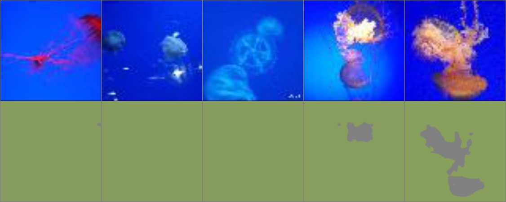
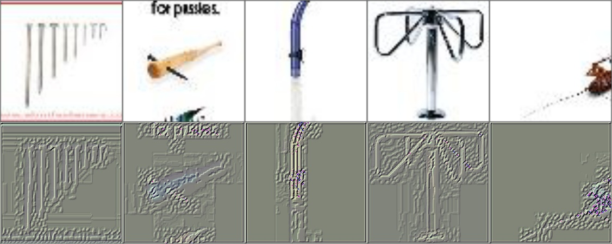
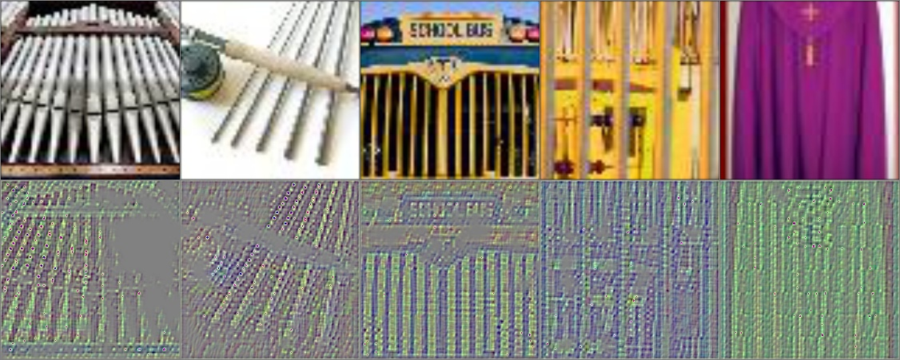
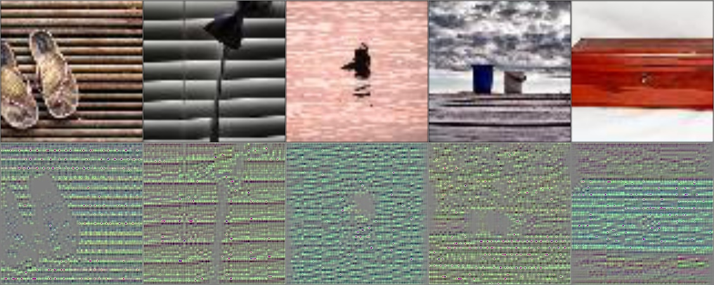
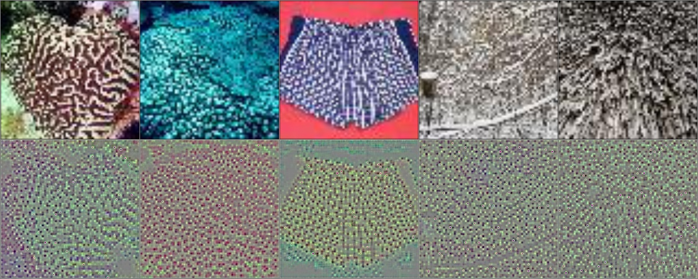
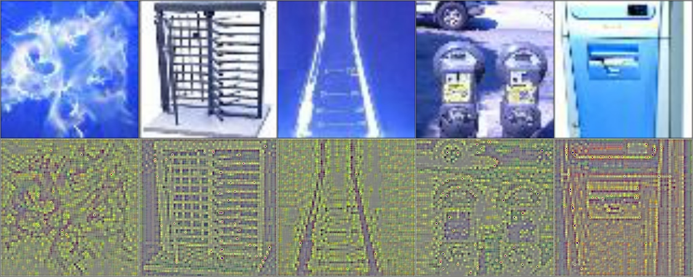
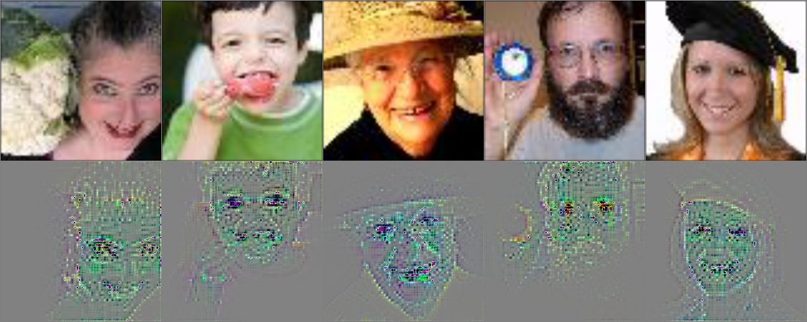
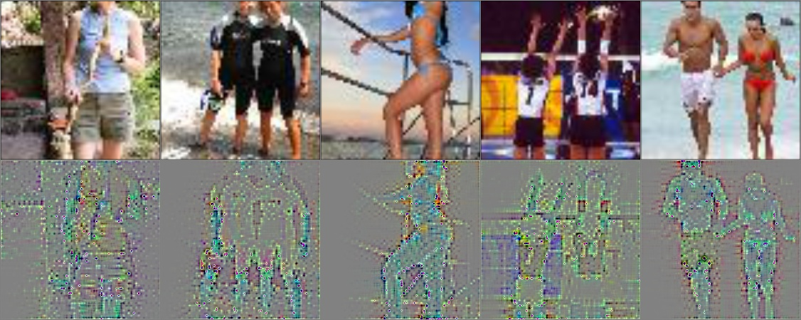
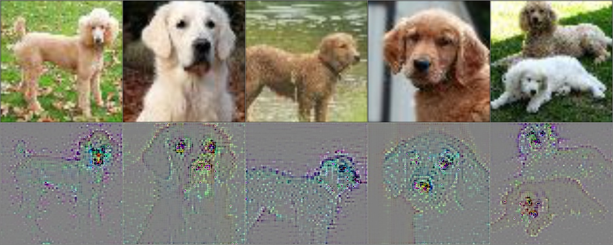
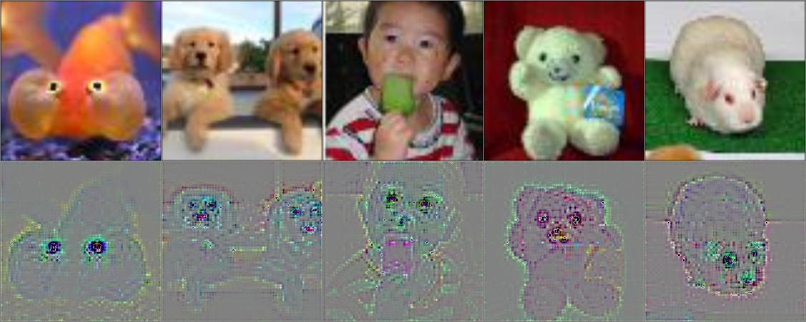

# Visualising VGG using the Deconvnet technique

# Abstract
[Zeiler et al.](https://cs.nyu.edu/~fergus/papers/zeilerECCV2014.pdf) developed a technique for visualising the operation of convolutional neural networks by mapping the 
activations of intermediate layers back to the input pixel space. This technique, which they called deconvnet, 
makes it possible to not only understand which images cause activations in a given layer, but also highlights parts of 
the picture causing that activation (e.g. strong edges, objects of a given colour, etc.).

I have created a general implementation of a deconvnet in Tensorflow, and used this implementation to explore the VGG 
image classification network, using a subset of the ImageNet dataset. First I used 10000 images from the validation set of 
the Tiny ImageNet Challenge and recorded the mean activation of each neuron in each layer of the pre-trained VGG model. 
Then for each neuron I selected 5 images producing the highest mean activation and calculated the deconvolution of these 
using the deconvnet. Finally I joined the visualisations of all neutrons in a each layer to create an overview of the 
activations of the layer, and used these visualisations to understand how the network works.

# Methods
## Network
I chose to visualise the VGG-16 network by Simonyan et al., using the Tensorflow implementation 
by [Mital](https://github.com/pkmital/CADL/blob/master/session-4/libs/vgg16.py). 
VGG was chosen as it was created after AlexNet, which was investigated in the original paper, partially in response to 
the problems with AlexNet (e.g. by using smaller convolutional filters but deeper layers to achieve the same receptive field),
yet it still has a simple structure which makes understanding relatively easy. VGG-16 was chosen over VGG-19 as the latter 
provides only marginally better results. VGG is a good baseline for modern image recognition tasks, as it strikes a good 
balance between producing accurate results and keeping the network simple. The downside of using VGG was that the network 
is large, having a large number of parameters in the FC layers, which makes the evaluation memory-intensive.

## Image dataset
Visualisations using a deconvnet rely on tracking the activations produced by the input images (as opposed to sampling 
the network itself), so fully understanding the network requires the input images to exhibit a wide range of features in 
order to find  high activations for each neuron. This can generally be achieved by using as many images as possible, 
which should include the training/validation set that was originally used to train the network, 
but can also include other image datasets. On the other hand evaluating a large number of images is time- and resource 
consuming, so I decided to use a subset of the ImageNet dataset called the Tiny ImageNet. 
Tiny ImageNet includes 200 classes from the original ImageNet dataset and has 50 images for each class, resulting in a total 
of 10000 images. (I have excluded grayscale images from the calculations to keep results comparable, so the final number used 
was 9832). 

It is important to understand that due to the nature of the deconvnet visualisations described above, this may mean that 
for some of the neurons none of the images presented here resulted in high activations, so their distinctive ‘attention’ 
can not be seen on the visualisations. This is the most likely explanation for why we can see multiple neurons that are 
seemingly highly activated for the same features on the same images – differences in their activation would be apparent 
had I used more images.

## Forward pass
The mean activations of each neuron were calculated for each image in the dataset. Images for each neuron providing the 
top 5 activations were selected and stored in a separate file. I was also planning to create counter-examples, 
so I also saved the images producing the smallest 5 activations, but to the lack of time this was not included in the 
analysis.

## Deconvnet
Zeiler et al. describes deconvnet as a a network which uses the same components (filtering, pooling) as the original 
network, but in reverse order. They calculate the activation of each neuron by manually creating the deconvolution 
network by iterating over all previous operations and attaching the appropriate deconvolution operation to the network. 
While this method works perfectly, it would make the deconvolution network difficult to create and manage, and specific 
to the given input network.

The original article hints on the fact and other expand on it that this deconvolution network is the same as calculating the 
gradient of a given neuron with respect to the input. Using the gradient instead of manually creating a deconvolution network 
is superior because Tensorflow (and all other comparable frameworks) already have high level abstractions for calculating 
the gradient of a layer w.r.t. the input, so instead of manually creating a complicated graph, we can offload that to 
Tensorflow with a simple call to the `tf.gradients` function. This enables the creation of a general function that can 
be used to visualise any network, not just the one selected for this study. (Before starting the actual work, I wanted 
to make sure that these two calculations are really equivalent, so I created a separate notebook to verify this on a 
small example.)

## Implementation details
Python 2.7 and Tensorflow 1.3 was used for all computations in this analysis. 
Prototyping was done on my laptop in a Docker environment, while the final images were generated on an Amazon P2 instance. 
Pandas was used for selecting the correct images for each neuron and Matplotlib was utilised for generating the final images.

All code created during the analysis is kept in the notebooks, as detailed below. 
My aim was to make it easy to follow how I solved the problem, rather than to create a simple API for 
performing the same analysis on a different network. The code is does not depend on the network though, 
and could be easily refactored. I did look at other implementations of the same technique as an inspiration, 
most notably tf_cnnvis, but did not directly copy code from them (except for the VGG network itself).

 - [Visualise convolution kernels.ipynb](Visualise%20convolution%20kernels.ipynb) - First I created a notebook to visualise the filters and the activations (not the gradients) in a minimal network on the MNIST dataset. This was only used to get used to working with Tensorflow and was not directly required to solve the task at hand.
 - [Verify deconvolution calculation.ipynb](Verify%20deconvolution%20calculation.ipynb) - I wanted to implement the deconvnet using the gradients calculated by Tensorflow, as opposed to building the graph myself. Before starting the work, I wanted to make sure that the two approaches are equivalent, so I created a minimal example comparing to verify that my thinking is correct. This pointed to flaws in my understanding, but eventually led to the conclusion that this is indeed a correct method.
 - [Calculate mean activations in VGG layers.ipynb](Calculate%20mean%20activations%20in%20VGG%20layers.ipynb)I calculated the mean activations of each neuron for each image in the dataset
 - [Merge mean activations and generate activation gradient plots.ipynb](Merge%20mean%20activations%20and%20generate%20activation%20gradient%20plots.ipynb) - Selected the top 5 images for each neuron and calculated the gradient of the activation
 - [Plot gradient images per layer.ipynb](Plot%20gradient%20images%20per%20layer.ipynb) Combined the plots for all neurons in a given layer to have an overview of the results

# Results
Visualisations generated using the deconvnet for VGG-16 provide insights that are in line with the findings of 
Zeiler et al. and others on the workings on a convolutional neural network. 
Neurons in low level convolutional layers exhibit high activation for simple image features like edges or a 
narrow colour range. Neurons in higher layers show high activations for higher level features like the presence of 
specific patters (like tiles, stripes, or textures of different materials) or colour combinations on the image. 
High level convolutional layers learn even more complex features, and some of them can be seen as being specific 
for complex shapes like faces or bodies of humans. Neurons in the fully connected layers are even more class specific, 
and some of them are directly linked to certain classes like dogs.

Looking at the top 5 images that activate a neuron sometimes suggests strong clues about what a given neuron is sensitive to. 
Generating the deconvnet images has the advantage that it helps us understand whether the network used the ‘obvious’ 
information in the image, which is directly related to the objects depicted, or if the network ‘cheated’ by taking into 
account other sources of information that we would consider insignificant – an example of this could be whether the 
network recognises a dog by looking at the texture of the fur and the shape of the face, of if it predicts the dog 
label by looking at the texture of the grass in the background. Based on the images generated in this project, 
we can safely say that VGG-16 is not ‘cheating’, so predictions are based on image features of the foreground object.

## Low level neurons from the first convolution block
Colour sensitivity:

Edge detection:

## Mid level neurons from the third convolution block
Vertical stripes:

Horizontal stripes:

Texture:

Blue-white colour combination:

## High level neuron from the fifth convolution block:
Faces (notice the prominent eyes in the gradinets)

Bodies

## Fully connected neurons from FC6 and FC7
Dogs:

Faces:

## Overview of 50 neurons from convolutional layer 5:
[Open in new tab](result_images/all_max_act_images_vgg_conv5_3_conv5_3_group_9.png)

# References / resources used
## Articles
 - https://cs.nyu.edu/~fergus/papers/zeilerECCV2014.pdf
 - http://www.matthewzeiler.com/wp-content/uploads/2017/07/snowbird2010.pdf
 - https://arxiv.org/pdf/1603.07285.pdf
 - https://distill.pub/2017/feature-visualization/
 - http://cs231n.stanford.edu/slides/2017/cs231n_2017_lecture12.pdf
 - http://andrew.gibiansky.com/blog/machine-learning/convolutional-neural-networks/
 - https://grzegorzgwardys.wordpress.com/2016/04/22/8/

## Code / other resources
 - https://github.com/InFoCusp/tf_cnnvis
 - https://github.com/pkmital/CADL/tree/master/session-4
 - https://tiny-imagenet.herokuapp.com
 - https://gist.github.com/yxlao/ef50416011b9587835ac752aa3ce3530
 - https://gist.github.com/awjuliani/acde9d491658265c3fbf6a74b91518e3#file-deep-layer-visualization-ipynb
 - http://www.robots.ox.ac.uk/~vgg/research/very_deep/
